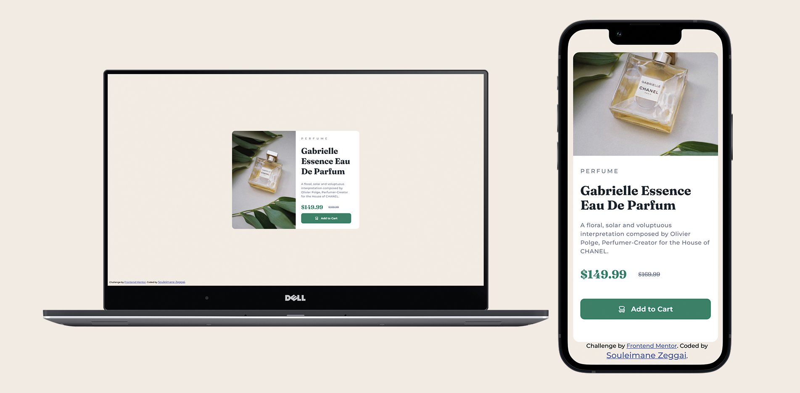

# Frontend Mentor - Product preview card component solution

This is a solution to the [Product preview card component challenge on Frontend Mentor](https://www.frontendmentor.io/challenges/product-preview-card-component-GO7UmttRfa). Frontend Mentor challenges help you improve your coding skills by building realistic projects.

## Table of contents

- [Overview](#overview)
  - [Screenshot](#screenshot)
  - [Links](#links)
- [My process](#my-process)
  - [Built with](#built-with)
- [Author](#author)

## Overview
Challenge sur Frontend Mentor, le but était de reproduire une image en HTML & CSS. Ensuite intégrer la partie responsive.

### Screenshot

### Links

- Live Site URL: [Demo](https://souleimane-z.github.io/Product-Page_SZ/)
- Solution URL: [Solution]()

## My process

This time, a responsive aspect of the page have been integrated. 

### Built with

- Semantic HTML5 markup
- CSS custom properties
- Flexbox
- Media Queries

## Author

- Website - [Portfolio Souleimane-z](https://www.souleimane-z.com)
- Frontend Mentor - [@souleimane-z](https://www.frontendmentor.io/profile/souleimane-z)
- LinkedIn - [Souleimane Zeggai](https://www.linkedin.com/in/souleimane-zeggai/)
